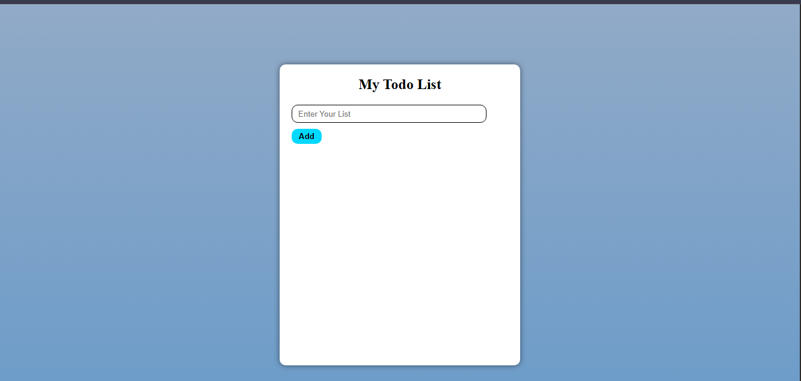
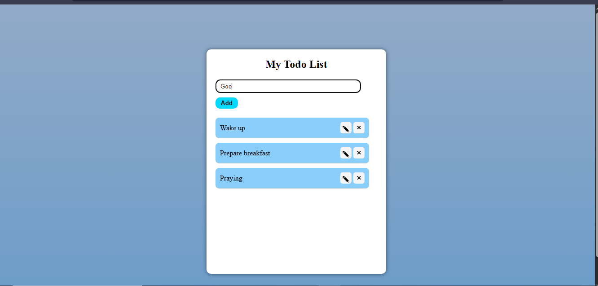
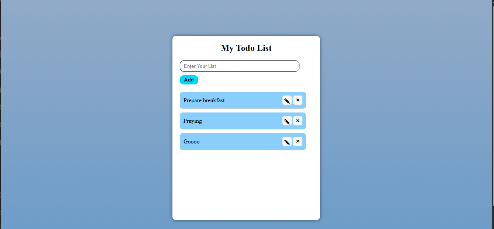
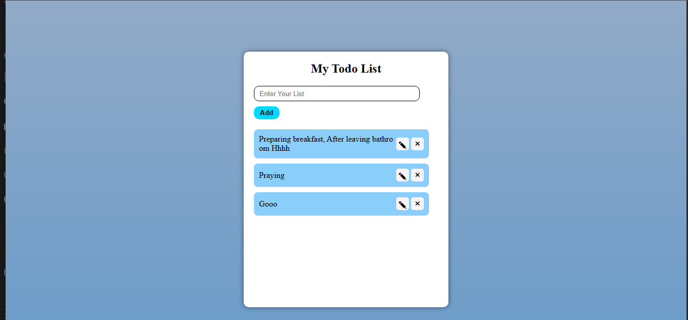

# WebTrack

## Overview

This is Todo List app made in js,html and css alone .

## How it works

1. Initialization

   - This is the how it looks when you get on it

2. Capture

   - You can add task by typing in the input box and click add 
   - Each relevant user interaction is captured by the event handlers on that add button.

4. Deletion of the first task wakeup

   - Captured data is transformed into a structured event object.

5. Update the task

    -

