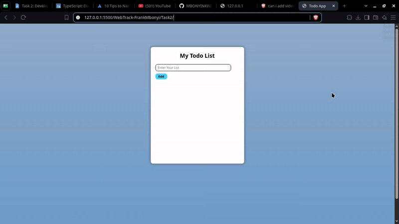

### This is the new ToDo App using Typescript
*Access the live todoapp on this link* https://task2todo.netlify.app/

## Here there is the Preview video of how it works the following operations:
    -Adding Task
    -Deleting Task
    -Updating Task
    -Save the Tasks in Local Storage
    -Render the Persisted tasks on refresh

